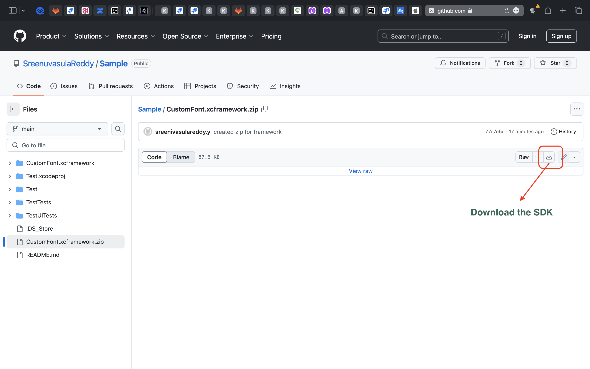
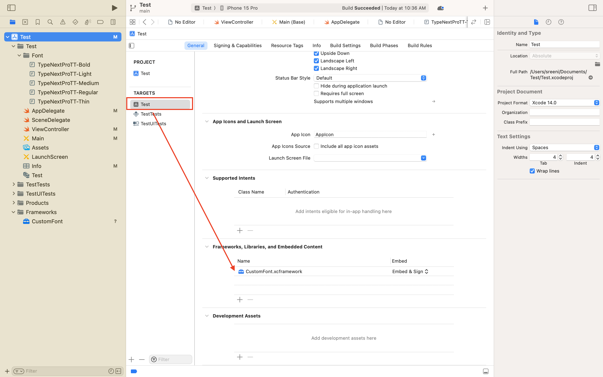
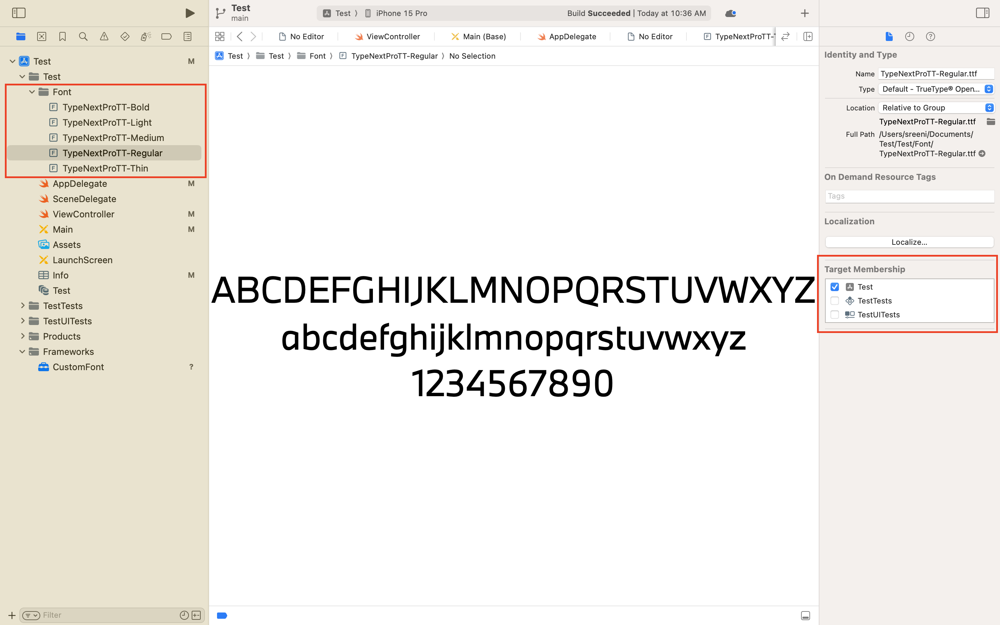
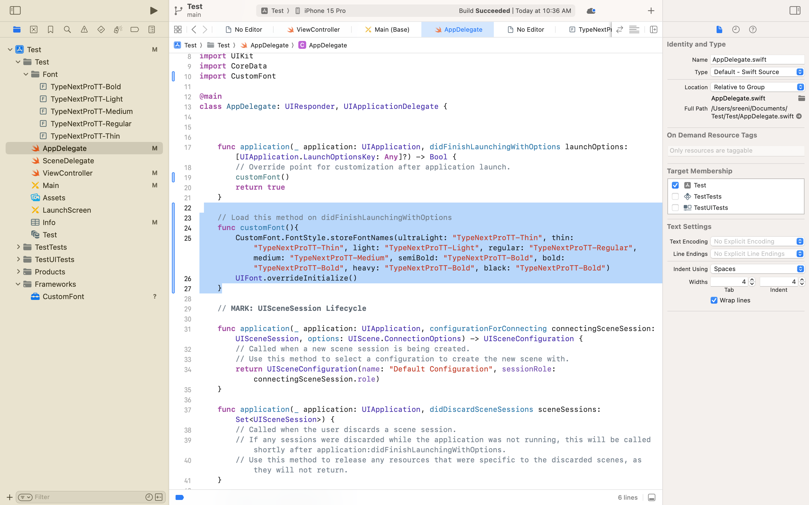

# Custom Font SDK for iOS


In iOS app development, changing fonts manually through storyboards for each UI element can be time-consuming and prone to errors, especially when updates are needed across the app. This manual process becomes inefficient as projects grow.

The **Custom Font SDK** solves this by allowing developers to manage and update fonts programmatically. With this SDK, you can easily load custom fonts without manually updating each element in the storyboard, saving time and reducing errors.

### Need for Custom Font SDK
- **Efficiency:** To avoid repetitive manual font changes through storyboards.
- **Dynamic Font Updates:** Update fonts across the app with just one integration.
- **Customization:** Seamlessly add and manage multiple custom fonts.
- **Easy Integration:** The SDK is easy to integrate and requires minimal changes to your project.
### Features
- **Dynamic Font Management:** Add custom fonts with just a few lines of code.
- **Programmatic Font Loading:** Load fonts into the SDK and use them across your app.
- **Minimal Storyboard Dependency:** Reduces dependency on storyboards for font management, allowing greater flexibility.
### Advantages
- **Save Time:** No need to manually update fonts via the storyboard, reducing the chance of human error.
- **Simplify Workflows:** With a streamlined process, fonts can be updated quickly and consistently throughout the app.
- **Reusability:** Use the same SDK across multiple projects or teams to maintain consistent font usage.
### How to integrate the Custom Font SDK
**Get the SDK:** [Download the Custom Font SDK.](https://github.com/SreenuvasulaReddy/Sample/blob/main/CustomFont.xcframework.zip "Download the Custom Font SDK.")



#### Step 1: Add SDK to target
1.	Open your project in **Xcode** and select the desired target.
2.	Go to the **General** tab.
3.	Scroll to the **Frameworks, Libraries, and Embedded Content** section.
4.	Click the + button to add a file.
5.	Select the **Custom Font SDK** and add it to your target.



#### Step 2: Add Custom Fonts
1.	Drag your custom font files (e.g., .ttf, .otf) into the Assets folder of your project.
2.	Ensure the fonts are listed in the Info.plist under the key Fonts provided by application.



#### Step 3: Load Fonts programmatically
Use the following code snippet to load your custom fonts into the SDK:

```swift
CustomFont.FontStyle.storeFontNames(ultralight: "font name" thin:"font name", light: "font name", regular: "font name", medium: "font name", semiBold: "font name", bold: "font name", heavy: "font name", black: "font name")
```
This method will store your custom font names in the SDK and allow you to access them throughout the app.
#### Example Usage:
```swift
import CustomFont
@main
class AppDelegate: UIResponder, UIApplicationDelegate {
   
    func application(_ application: UIApplication, didFinishLaunchingWithOptions launchOptions: [UIApplication.LaunchOptionsKey: Any]?) -> Bool {
        // Override point for customization after application launch.
        customFont()
        return true
    }
    
    // Load this method on didFinishLaunchingWithOptions
    func customFont(){
        CustomFont.FontStyle.storeFontNames(ultralight: "font name" thin:"font name", light: "font name", regular: "font name", medium: "font name", semiBold: "font name", bold: "font name", heavy: "font name", black: "font name")
        UIFont.overrideInitialize()
    }
}
```

Here you can store your font style names to sdk.

 

### Thank you for reading. We hope you found it helpful! 😊

